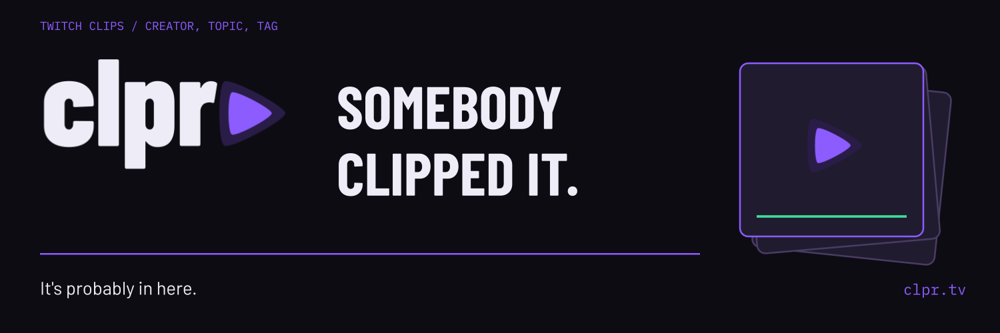

# clpr

**Somebody clipped it. It's probably in here.**

clpr sorts Twitch clips by creator, topic and tag. Search for the one you half
remember, save clips into playlists, and send a playlist to the people who
missed the stream.

[Explore clpr](https://clpr.tv) · [Product overview](https://subcult.tv/products/clpr) · [Report a bug or suggest a feature](https://git.subcult.tv/subculture-collective/clpr/issues)

## What it does

- **Browse and search:** find Twitch clips by creator, topic, tag or Twitch category.
- **Playlists:** save clips into playlists and share them.
- **Submit:** send in an existing Twitch clip that isn't on clpr yet.
- **Vote and comment:** upvotes and comments move clips in the feed. Reporting
  and moderation tools cover the rest.

## Available today

clpr is available as a responsive web application at [clpr.tv](https://clpr.tv).
Native mobile apps are planned. Stream clip extraction, live feeds, watch parties,
and media mirroring remain outside the current release. The
[launch feature inventory](docs/LAUNCH_FEATURE_INVENTORY.md) records the supported scope.

## Build with us

Want to run your own instance or improve the clip hunt? Start with the [development guide](DEVELOPMENT.md) for configuration,
local services, and verification, or the [contributor guide](docs/contributing.md)
to work on a change.

- [Backend setup](backend/README.md)
- [API reference](docs/openapi/README.md)
- [Operations runbooks](docs/operations/runbooks/README.md)

Built by [Subcult](https://subcult.tv). Licensed under [MIT](LICENSE).
